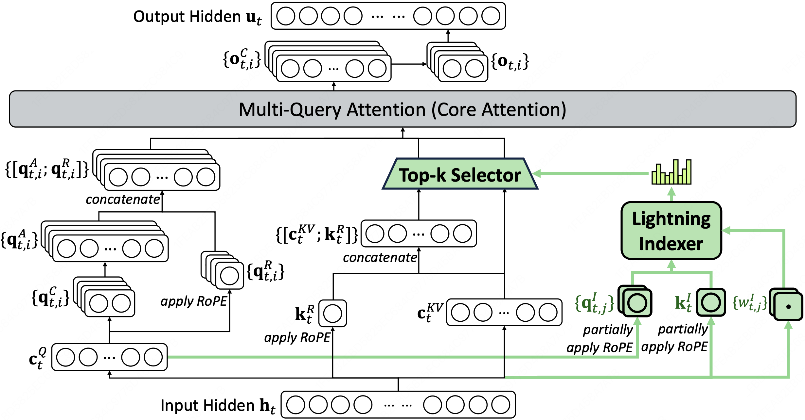
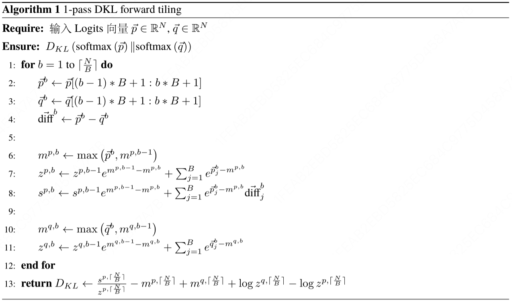
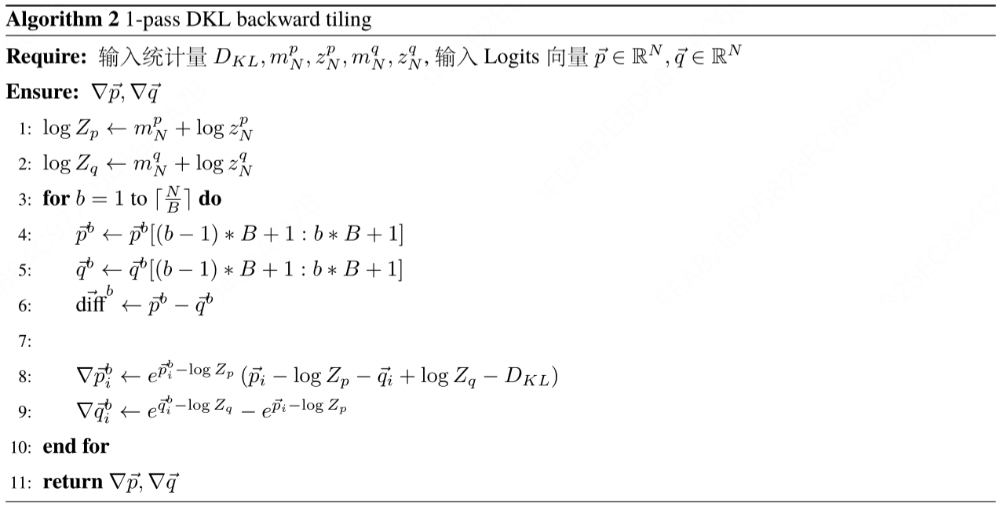

# DeepSeek-V3.2-Exp DSA Warmup Lightning Indexer training operator implementation based on TileLang

<p align="center">


</p>

English | [简体中文](README.zh_CN.md)

- [DeepSeek-V3.2-Exp DSA Warmup Lightning Indexer training operator implementation based on TileLang](#deepseek-v32-exp-dsa-warmup-lightning-indexer-training-operator-implementation-based-on-tilelang)
  - [1. Latest news](#1-latest-news)
  - [2. Performance evaluation](#2-performance-evaluation)
  - [3. Quick start](#3-quick-start)
  - [4. Design Decisions](#4-design-decisions)
    - [4.1 Background knowledge](#41-background-knowledge)
      - [4.1.1 DSA Warmup Lightning Indexer Algorithm](#411-dsa-warmup-lightning-indexer-algorithm)
      - [4.1.2 one-pass KL Divergence fwd/bwd algorithm](#412-one-pass-kl-divergence-fwdbwd-algorithm)
      - [4.1.3 TileLang just-in-time compilation](#413-tilelang-just-in-time-compilation)
    - [4.2 Decision space](#42-decision-space)
      - [4.2.1 Design of target distribution](#421-design-of-target-distribution)
      - [4.2.2 Operator Grid partition (per head or not)](#422-operator-grid-partition-per-head-or-not)
      - [4.2.3 Data types of Lightning Indexer](#423-data-types-of-lightning-indexer)
  - [5. Future routes](#5-future-routes)
  - [6. Acknowledgments](#6-acknowledgments)

## 1. Latest news

- 2025/11/19 ✨: We are pleased to announce that ***<u>tl-dsa-warmup-lightning-indexer</u>*** - DeepSeek-V3.2-Exp DSA Warmup Lightning Indexer ***training operator*** based on [tilelang](https://github.com/tile-ai/tilelang/tree/4a9cb47056d78e914673497951a348cb096b5cef), is now open source!

## 2. Performance evaluation

- <u>***tl-dsa-warmup-lightning-indexer***</u> operator is compatible with Flash Attention. Its forward pass outputs Flash Attention output and KL Divergence at the same time; its backward pass calculates the gradient of KL Divergence.
- Taking Flash Attention as the benchmark, the following table intuitively gives the current performance level of this operator (automatically optimized by tilelang.autotuner.autotune)

```text
======================================================================================================
  varlen Setting (bs, seq_len)               Fwd Latency                          Bwd Latency
--------------------------------   -------------------------------       -----------------------------
total     batch     seq_len        TL Kernel   flash_attn    Ratio       TL Kernel   flash_attn  Ratio
seq_len   size      qk             (ms)        (ms)                      (ms)        (ms)
======================================================================================================
8K        4         2048           1.99        0.88          2.26x       15.42       3.07        5.02x
16K       8         -              3.96        1.72          2.30x       30.54       5.96        5.12x
32K       16        -              7.81        3.42          2.28x       60.52       11.74       5.16x
64K       32        -              15.59       6.97          2.24x       119.50      23.30       5.13x
128K      64        -              31.05       14.01         2.22x       238.40      46.42       5.14x
======================================================================================================
```

## 3. Quick start

```bash
python3 kernel_bf16_training_dsa_warmup_lightning_indexer.py --verbose --batch 4
```

## 4. Design Decisions

### 4.1 Background knowledge

#### 4.1.1 DSA Warmup Lightning Indexer Algorithm



- The core algorithm of DSA in [DeepSeek-V3.2-Exp](https://github.com/deepseek-ai/DeepSeek-V3.2-Exp/blob/main/DeepSeek_V3_2.pdf) is a two-stage algorithm, in which the first stage (Warmup) freezes the parameters of the main model and only trains the Lightning Indexer

  - Lightning Indexer is more lightweight: has smaller num_heads, head_dim, and can use fp8 precision

  - The complexity of calculating Logits for both Lightning Indexer and the main model are both $$O(N^2)$$ , but its lightweight design gives it the potential to calculate Full Attention more efficiently.

  - Lightning Indexer implements alignment with main model calculation logits through KL Divergence

  - A well-aligned Lightning Indexer can more efficiently calculate ***approximately accurate*** Logits, providing input data for the subsequent Top-k Selector stage of DSA

  - NOTE: DSA is trained using MLA’s **MQA** mode, as described in the paper

> Therefore, we implement DSA based on the MQA mode of MLA.

- As shown in the figure, enter hidden states $$𝐡_t \in ℝ^d$$ will be projected as $$𝐪_{t,j}^I \in ℝ^{d^I}$$ , $$𝐤_{t}^I \in ℝ^{d^I}$$ , $$w_{t,j}^I \in ℝ$$

  - The Logits expression calculated by Lightning Indexer is $$I_{t,s} = \sum_{j=1}^{H^I} w_{t,j}^I \cdot \text{ReLU}\left(𝐪_{tj}^I \cdot 𝐤_s^I\right)$$
  - That is: the logits $$I_{t,s}$$ between token $$t$$ with token $$s \; (s\leq t)$$ are the weighted sum of $$\text{Logits}_{t,s}^{h^I}.\text{relu}()$$ from different indexer heads
  - where the weight coefficients $$w_{t,j}^I \in ℝ$$ are projected from the input hidden states, used to measure the importance of a specific query token under a certain Indexer head

- The training loss of Indexer is $$ℒ^I = \sum_t 𝒟_{\text{KL}}(p_{t,:} \| \text{Softmax}(I_{t,:}))$$

  - The probability distribution of the main model in the paper $$p_{t,:}$$ is described as:

> To align he indexer outputs with the main attention distribution, for the t-th query token, we first aggregate the main attention scores by summing across all attention heads. This sum is then L1-normalized along the sequence dimension to produce a target distribution $$p_{t,:} \in ℝ^t$$

  - The expression of the above process can be written as $$p_{t,:} = \frac{\sum_{h=1}^H A_h[t, :]}{\Vert \sum_{h=1}^H A_h[t, :]\Vert_1}$$ , that is, "Softmax first and then average"

#### 4.1.2 one-pass KL Divergence fwd/bwd algorithm

- KL Divergence is defined as $$𝒟_{KL}(P \| Q) = \sum_{i} P(i) \log \frac{P(i)}{Q(i)}$$ , here $$P(i)$$ or $$Q(i)$$ are calculated as the Softmax results of Logits $$p(i)$$ or $$q(i)$$ . If KL Divergence is calculated according to the definition, it is required to materialize all Logits
- The way to calculate KL Divergence according to the definition method is not memory-efficient, and is contrary to the idea of Flash Attention. The actual application of KL Divergence needs to be compatible with Flash Attention, which requires that KL Divergence can be accumulated through gradual access to Query/Key tiles, that is, it has the properties of a one-pass algorithm
- One-pass KL Divergence is compatible with flash attention. It completes KL Divergedsnce calculation while flash attention traverses the process, and outputs flash attention results and KL Divergence results at the same time.
- The input for the ***Tiling*** version below is Logits $$\vec{p}\inℝ^N$$ and $$\vec{q}\inℝ^N$$ . The pseudo code for KL Divergence forward and backward pass are as follows. In practical applications, it needs to be further promoted to ***two-dimensional*** and ***varlen*** forms





#### 4.1.3 TileLang just-in-time compilation

- TileLang can adapt to the batch_size, seq_len_q, seq_len_k and other parameters of the incoming Tensor, which is extremely useful in varlen scenarios.

### 4.2 Decision space

During the operator implementation process, we noticed some design choices that may affect the final implementation, summarized as follows:

#### 4.2.1 Design of target distribution

- According to the original text of the paper, $$p_{t,:} = \frac{\sum_{h=1}^H A_h[t, :]}{\Vert \sum_{h=1}^H A_h[t, :]\Vert_1}$$ . Let $$\text{Softmax}(\text{Logits}^\prime_{t, :}) = p_{t,:}$$ and $$\text{Softmax}(\text{Logits}^h_{t, :}) = A_h[t, :]$$ , easy to know $$\sum_h \text{Logits}^h_{t, :} \neq \text{Logits}^\prime_{t,:}$$
- According to the above one-pass kl divergence fwd/bwd algorithm, you may need to know the expression before Softmax. $$\text{Logits}^\prime_{t,:}$$
- ***<u>Here, we choose to implement the idea of one-pass kl divergence fwd/bwd algorithm, so we do not solve the concrete expression of</u>* ** $$\text{Logits}^\prime_{t,:}$$
- An option is to use $$\sum_h \text{Logits}^h_{t, :}$$

#### 4.2.2 Operator Grid partition (per head or not)

- The Grid of flash attention related operators is often divided according to the dimensions of batch / max_seq_len / head, that is, each thread group only processes one attention head and executes the same logic per head. Taking the tilelang syntax as an example, the form is as follows:

  ```python
  with T.Kernel(
    T.ceildiv(max_seq_len, block_M),
    heads,
    batch_size,
    threads=num_threads
  ) as (bx, by, bz):
    ...
  ```

- If using $$\sum_h \text{Logits}^h_{t, :}$$ Then all attention heads need to be processed in the same thread group. Correspondingly, the Grid division of flash attention related operators will also be modified to

  ```python
  with T.Kernel(
    T.ceildiv(max_seq_len, block_M),
    batch_size,
    threads=num_threads
  ) as (bx, bz):
    ...
  ```

- In the initial implementation of this operator, we chose such a Grid layout for development. However, due to the limitations of the rationality of the algorithm itself and the design of TileLang, this development method has not yet been fully implemented.
  - The rationality of the algorithm itself: In the commonly used per head layout, the tiles in the row and column dimensions can be opened larger; however, the row and column dimensions of the non-per head layout cannot be opened larger due to the baggage of num_heads, which may lead to potential memory pressure.
  - Limitations of TileLang design: The TileLang version used to develop this operator is [0.1.6.post1+cu126.git7a5077e4](https://github.com/tile-ai/tilelang/commit/7a5077e4aa8e30533b6fe1f0716b2c28cf6f661b). As of the time of developing this operator, TIleLang design still has limitations and cannot support this development idea well. The relevant content is recorded in [tile-ai / tilelang Issues #1199 ](https://github.com/tile-ai/tilelang/issues/1199)
- ***<u>Therefore, we choose to still use the per head layout to complete the alignment of the indexer head and the model attention head to calculate logits head by head</u>***

#### 4.2.3 Data types of Lightning Indexer

- According to the original text of the paper, Lightning Indexer chooses to use the fp8 data type as one of the efficiency advantages of Lightning Indexer
- During the implementation of Lightning Indexer's backpropagation operator, it was discovered that the gradient between fp8 and bf16 requires additional consideration; and Lightning Indexer may use the bf16 data type during training and the fp8 data type during inference.
- ***<u>For the purpose of developing operator prototypes, we chose to use bf16 to develop Lightning Indexer first, and later support the fp8 data type</u>***


***Finally, our design choices:***

- ***<u>Let the Lightning Indexer have the same number of heads as the main model, and use the bf16 data type to align the Logits calculated by the Lightning Indexer and the main model head by head</u>***
- Although the three major advantages of Lightning Indexer (1) fp8 (2) less num_heads (3) less head_dim are temporarily missing the first two, we still retain the advantage of lower head_dim, and kl divergence is compatible with flash attention, and has the advantages of Fast & Memory efficient

## 5. Future routes

- [ ] Consider hardware characteristics and improve operator logic

- [ ] Improve support for FP8 training

- [ ] Provides an implementation closer to the original DSA text, processing all attention / indexer heads in the same thread group
- [ ] Stricter accuracy verification

## 6. Acknowledgments

- [tile-ai / tilelang](https://github.com/tile-ai/tilelang/tree/main)
- [rockbenben / md-translator](https://github.com/rockbenben/md-translator)
- [svenkreiss / unicodeit](https://github.com/svenkreiss/unicodeit/tree/main)
